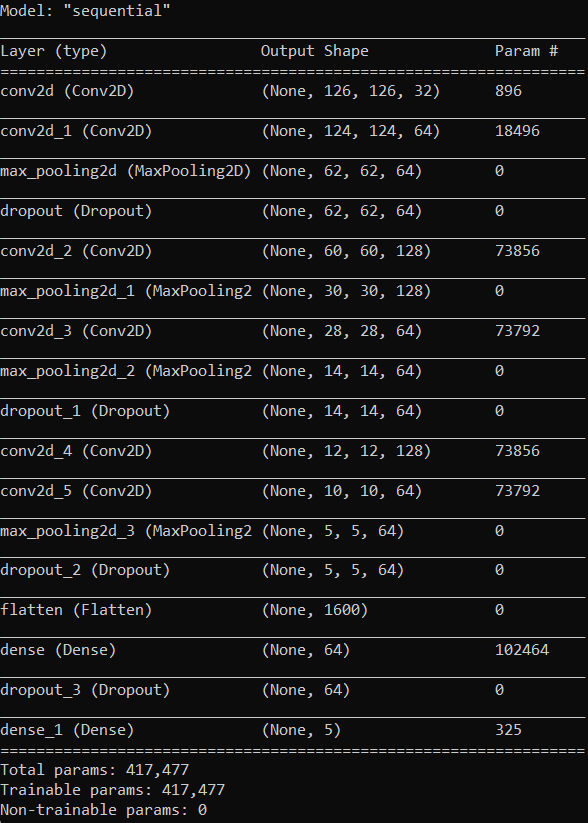
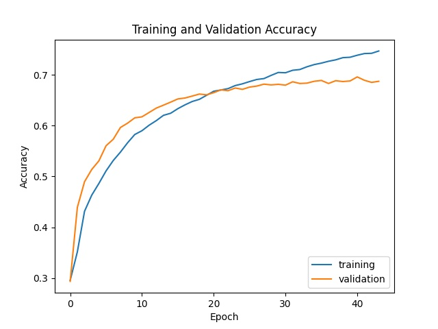
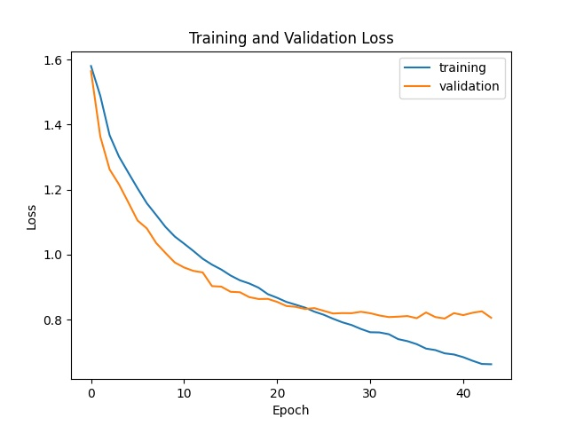
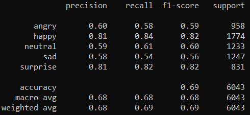

## Facial Expression Recognition


### Prerequisites
* Python 3.6
* Tensorflow 2.5.0
* Keras 2.6.0

*Tested on Windows 10 - 64 bit*

---
### Dataset
* [FER-2013](https://www.kaggle.com/msambare/fer2013) from Kaggle.
* Dataset has 7 classes: angry, disgust, fear, happy, sad, surprised, and neutral.

---
### How to use
* Step 1: Training model. *Skip if using the **attached model***.
    ```
    python train.py
    ```
* Step 2: Testing model through your webcam.
    ```
    python test.py
    ```

* **Notice:** This model will work best if users * **do not** * wear glasses.

---
### Neural Network Architecture

<p align='middle'></p>

---
### Evaluation

<p align='middle'>
  
   
</p>
<p align='middle'></p>

---
### References
2. [Priya Dwivedi. Face-and-Emotion-Detection.](https://github.com/priya-dwivedi/face_and_emotion_detection/blob/master/src/EmotionDetector_v2.ipynb)
3. [Akamadan. Emotion-Detection-CNN.](https://github.com/akmadan/Emotion_Detection_CNN/blob/main/emotion-classification-cnn-using-keras.ipynb)
4. [Great Learning (2020). Emotion Detection using Python.](https://www.youtube.com/watch?v=m0fWjP3yIEo&ab_channel=GreatLearning)