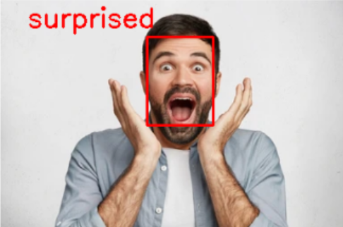
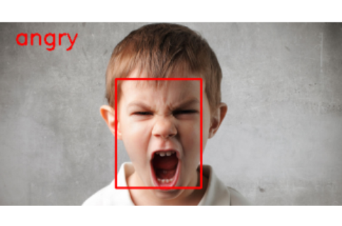

## Facial Expression Recognition

### Notices
* I strongly recommend that you use Google Colab to train model as well as test.
* Download source code [here]('https://drive.google.com/drive/folders/18kd8w70wANlQ8tSldH2aLy6SVO9YYz9s?usp=sharing').

### Dataset
* [FER-2013](https://www.kaggle.com/msambare/fer2013) from Kaggle.
* Dataset is converted into CSV file for saving training time.
* The original dataset has 7 classes (angry, disgust, fear, happy, sad, surprised, neutral) but I have removed 'disgust' class and 'fear' one because these two expressions are not clear.

### How to use
1. Run **train_model.ipynb** if you want to train model from scratch. Otherwise, you can use my model including **fer.json** and **fer.h5**
2. Run **via_image.ipynb** to recognise on images
3. Run **via_webcam.ipynb** to test model on webcam. Actually, it just uses your webcam to capture and the images will be processed similar to **via_image.ipynb** 

### References
1. [Priya Dwivedi (2019). Face Detection, Recognition and Emotion Detection in 8 lines of code!](https://towardsdatascience.com/face-detection-recognition-and-emotion-detection-in-8-lines-of-code-b2ce32d4d5de)
2. [Priya Dwivedi. Face-and-Emotion-Detection](https://github.com/priya-dwivedi/face_and_emotion_detection/blob/master/src/EmotionDetector_v2.ipynb)
3. [Akamadan. Emotion-Detection-CNN](https://github.com/akmadan/Emotion_Detection_CNN/blob/main/emotion-classification-cnn-using-keras.ipynb)
4. [Great Learning (2020). Emotion Detection using Python](https://www.youtube.com/watch?v=m0fWjP3yIEo&ab_channel=GreatLearning)
5. [The AI Guy (2020). How to Use Webcam In Google Colab for Images and Video](https://www.youtube.com/watch?v=YjWh7QvVH60&ab_channel=TheAIGuy)