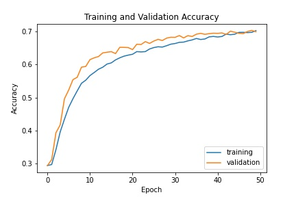
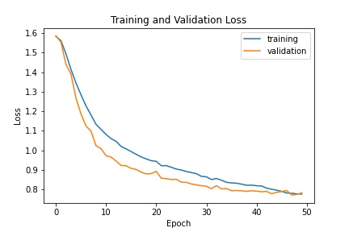

## Facial Expression Recognition

### Prerequisites
* Python 3.6
* Tensorflow 2.5.0

*Tested on Windows 10 - 64 bit*

---
### Dataset
* [FER-2013](https://www.kaggle.com/msambare/fer2013). There are 7 classes: `angry`, `disgust`, `fear`, `happy`, `neutral`, `sad`, and `surprised`. In my case, I only used 5 classes (not using `disgust` and `fear`).
* [MMAFEDB](https://www.kaggle.com/datasets/mahmoudima/mma-facial-expression). This dataset is used to visualize the outcomes that the model predicts. I deleted most of samples in each class to reduce the storage space.

---
### How to use
* Step 1: Training model. Open `jupyter notebook` and run `train.ipynb`. The evaluation process is performed in this `.ipynb` file.
* Step 2: Testing model through your webcam.
    ```
    python test.py
    ```
---
### Results

<p align='middle'>
  
   
</p>